## React native front end for creating Exam Widgets

## Shubham Sharma

#### Java Middle tier server repo
- https://github.com/shubhsharma10/cs5610-summer1-2018-java-server-ssharma

#### Development and Test environment
- Windows 10
- Android
- Genymotion

#### Screenshots

  

  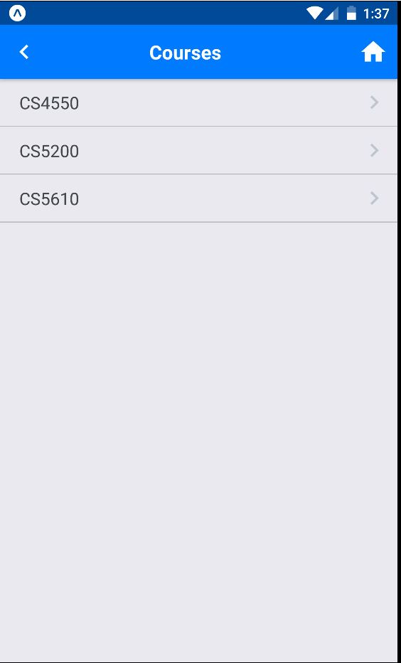
  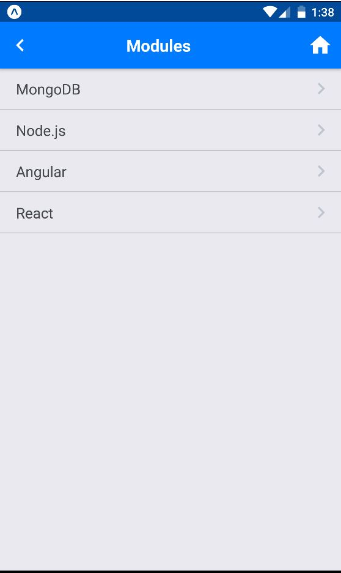
  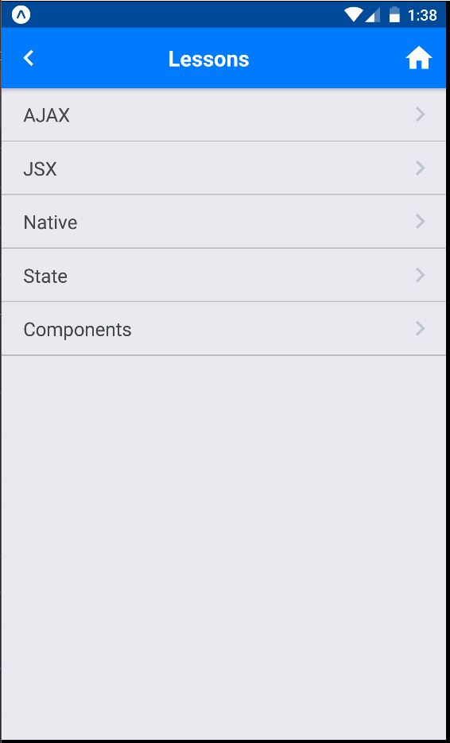
  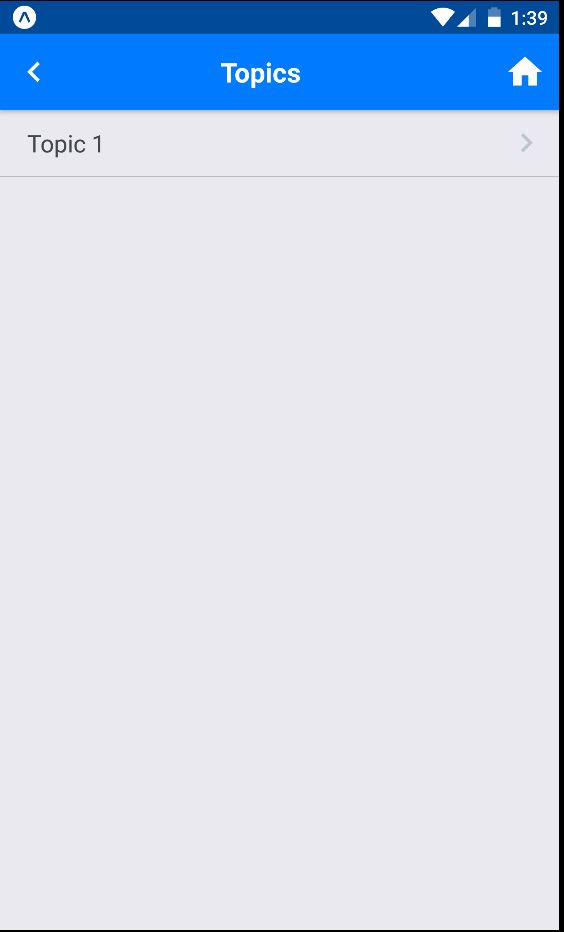

  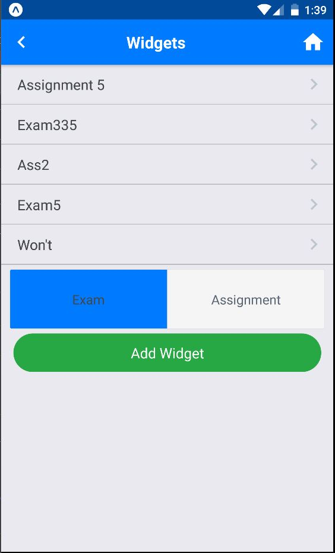

   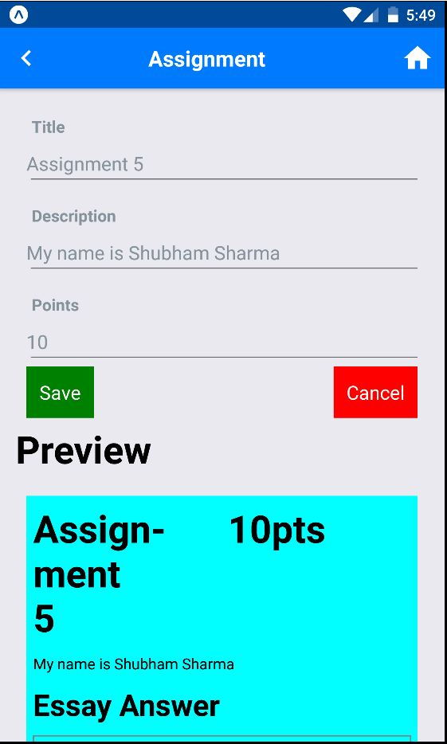
   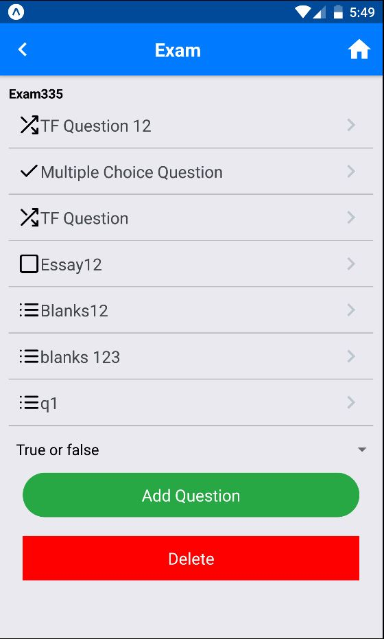

  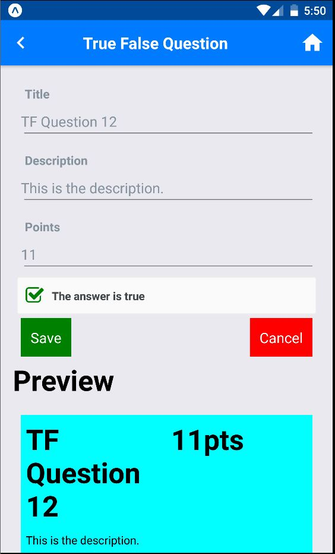
  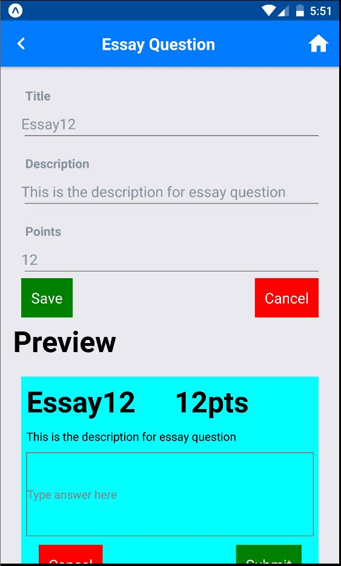
  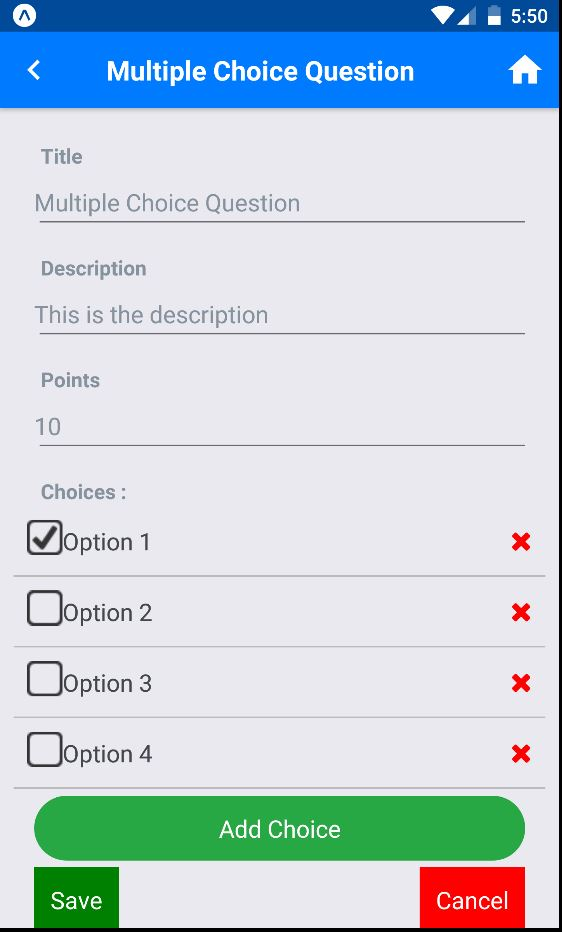

  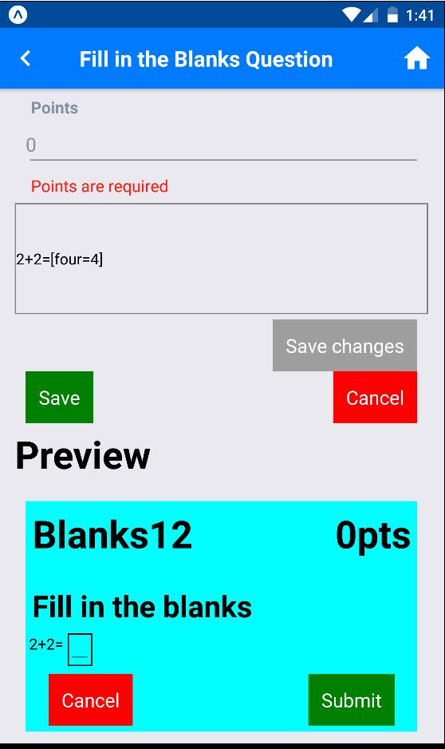
  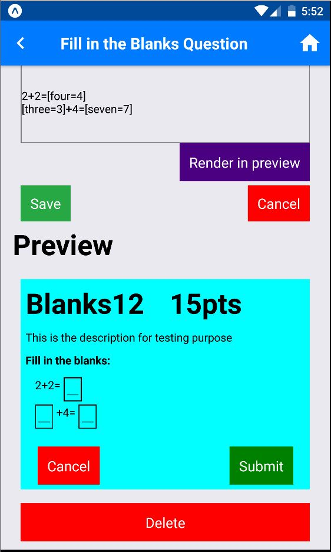

