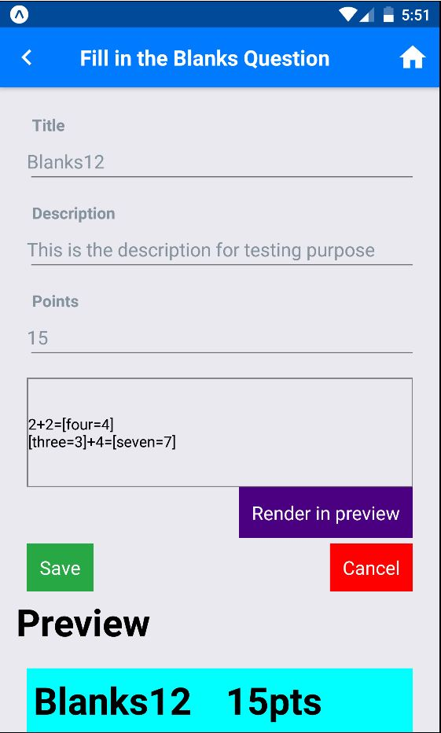

# React native mobile app for creating Exam and Assignment Widgets

#### Java Middle tier server repo
- https://github.com/shubhsharma10/cs5610-summer1-2018-java-server-ssharma

#### Development and Test environment
- Windows 10
- Android
- Genymotion

### Known Issues
- Since server is hosted on Heroku, if network is slow setState called on unmounted component warning comes.

#### Screenshots

  

  
  
  
 

    
    

   
   

  
  
  

  
  

